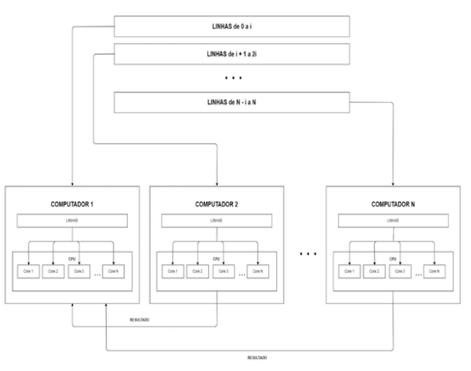
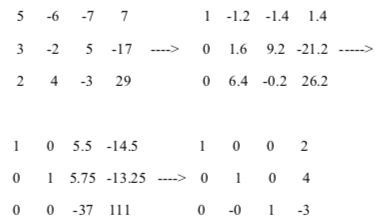
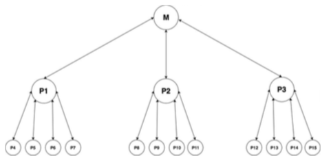
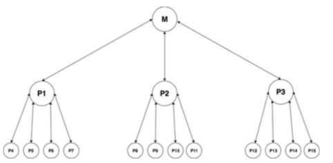
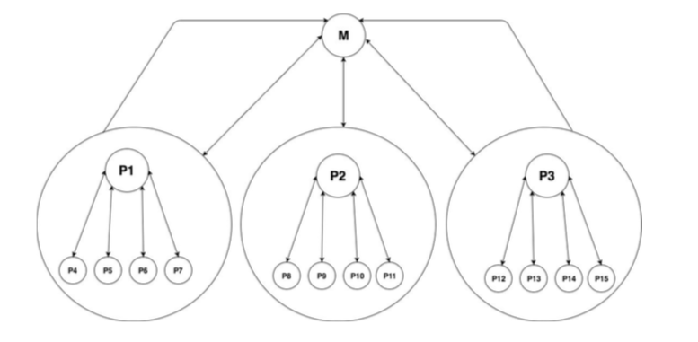

# Gauss Jordan Elimination - PCAM

OVERVIEW
--------------------------------------------------
The aim of this project is to apply the PCAM (Partitioning, Communication, Agglomeration and Mapping) methodological approach to the design of Gauss Jordan Elimination parallel algorithm for the [Parallel/Concurrent Programming] course. It was made at the Computer Science undergraduate program from University of São Paulo (ICMC - USP).

PROJECT
--------------------------------------------------
In linear algebra, the linear system solution algorithm known as Gauss-Jordan Elimination is a version of the Gauss Elimination that zeroes the elements above and below the pivoting element as it traverses the matrix. In other words, the elimination of Gauss-Jordan transforms the matrix into a reduced column staggered form.

PARALELISM
--------------------------------------------------
The first step in developing the parallel algorithm is to decompose the problem into tasks that can be performed concurrently. One of the forms of decomposition can be illustrated in the form of a directed and acyclic graph (task dependency graph) with nodes that correspond to the tasks and edges which indicate the result of a task for the next processing.

PARTITIONING
--------------------------------------------------
This step refers to breaking the program into workbooks that can be distributed in fine granularity tasks that can be performed concurrently.
Firstly, it is necessary to understand in general lines the operation of the sequential algorithm
The algorithm receives an increased matrix of size n x m. It then needs to do n "big steps," one for each line, which results in the adjustment of line n (pivot line) and multiplication of that pivot line to zero the columns corresponding to that element.
Example of an augmented 3x4 matrix:

Within this large step, n x m operations are required because each element of the matrix will be adjusted within this large step. So for this small example we would have 3 big steps and 12 small ones, resulting in 36 basic arithmetic operations.
The large step (outermost loop, which is repeated from 1 to n lines) are dependent on each other, to carry out the next step it is necessary that the previous step is complete.

The small steps are independent of the data, ie it is possible to perform the operations separately, and this leads to a data-partitioning approach.
From these conclusions, we decided to partition the problem in two ways. First we do a partitioning of tasks where each task is either the adjustment of the pivot line or it is the multiplication of the pivot line by the other n-1 lines.
Then we partition these received lines by each of the processes in atomic operations (sums and subtractions) and this partitioning is where we explore more strongly the parallelism of this algorithm.

Example for a 3x4 matrix:

COMMUNICATION
--------------------------------------------------
This step refers to the determination of a communication pattern determined by the dependence of data between tasks. Most parallel applications are not as simple and require tasks to share data with each other.
At this stage of the methodology, we must pay attention to the information necessary for each task to perform the computation that has been assigned to it.
We have in principle a master task whose function is to divide our problem and send a message to the other tasks containing their respective parts. This same master task is also responsible for waiting for the completion of the other tasks (end of the so-called "big step"), gathering the results and starting the step Following.
Each task will receive from the master task the pivot line and the line that must be adjusted in relation to the pivot line and must return to the master this result also by exchange of messages.
As it was proposed to run the application in Cluster Multicore, we must carry out the exchange of messages through for example an ethernet network. The master computer must communicate with others in a bidirectional way, and it is not necessary for the other computers to be linked together because they perform independent tasks.
There is a need to wait for the tasks to finish and to report their results to the master, which can be guaranteed by using approaches such as the semaphore.

AGGLOMERATION
--------------------------------------------------
This section refers to the combination of fine granularity task groups for the formation of few tasks of gross granularity, thus reducing communication requirements.
Thick granularity is when there are large stretches of code with low communication, meaning there is less potential for parallelism exploration.
From the dependency graph, we can see that "small step" tasks can be clustered together in one process rather than having multiple processes. This practice helps us decrease the overhead generated in the communication between them.

MAPPING
--------------------------------------------------
This section refers to the mapping of bulk granularity tasks to multiple processors, which is a critical step in minimizing parallel processing overhead.
The mapping was thought according to the figure (FIGURE)
After the steps of partitioning, communication, clustering and taking into account the environment chosen to run the application, we must now map each task to a cluster node.
At first, each line of our array will be sent to the cluster node, and this implies that for an array with N rows, we would need N computers, which is a situation Unreal
We can work around this by assigning a greater number of rows passed to our cluster, as we can see in the figure, and this is also in charge of our master computer. This implies a lesser parallelism, but in return we also have less overhead generated by the communication.

CREDITS
--------------------------------------------------
- Eder Rosati Ribeiro
- Pedro Puzzi
- Wesley Tiozzo

MORE INFO
--------------------------------------------------
You can find more information about the project in the file:  `project report.pdf`
